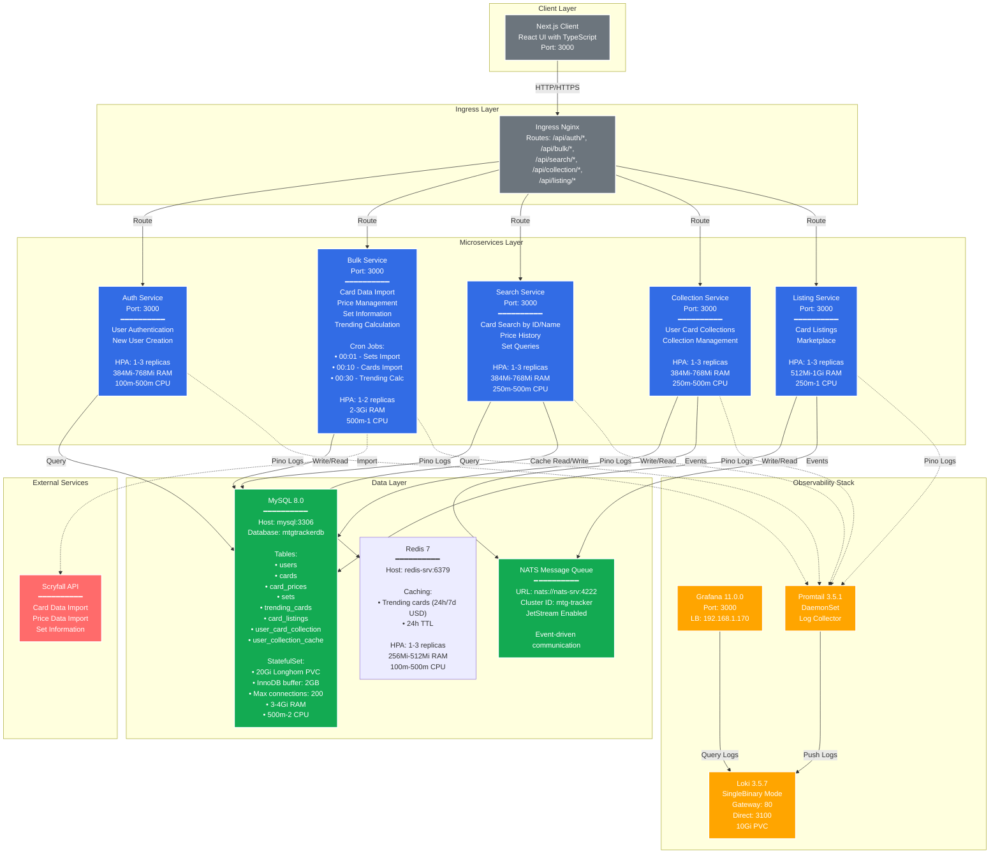

# MTG Tracker

Testing Action

## Feature Addition Timeline
- [x] Horizontal Pod Autoscaling - 11/25/25
- [x] Health Checks - 11/25/25
- [x] Pino Log for Loki Grafana - 11/26/25
- [x] Redis Caching on Trending 24h/7d USD calls - 11/27/25
- [ ] Rate Limiting
- [ ] Auth Enforcement
- [ ] Monitoring and Alerting
- [ ] Connection Pool Management and Logging
- [ ] Input validations
- [ ] Metrics: Request rates
- [ ] Metrics: Error rate (%failed requests)
- [ ] Metrics: Response times (p50, p95, p99)
- [ ] Metrics: Concurrent requests

## Architecture

### Infrastructure
- **Kubernetes**: 3-node cluster
- **Storage**: Longhorn for persistent volumes
- **GitOps**: ArgoCD for automated image updates
- **Development**: Skaffold for local development
- **Namespaces**: default (services), loki (observability)
- **Autoscaling**: Horizontal Pod Autoscalers (HPA) on all services
  - Scale based on CPU (80%) and Memory (85%) utilization
  - Conservative scaling policies to prevent flapping

### Key Features
- **Microservices Architecture**: Independent services for auth, bulk operations, search, collections, and listings
- **Event-Driven**: NATS message queue for inter-service communication
- **Scheduled Jobs**: Automated daily card/price imports and trending calculations (cron-based)
- **Optimized Database**: MySQL with 2GB InnoDB buffer pool for high-performance queries
- **Centralized Logging**: Loki stack for log aggregation across all services
- **Container Orchestration**: Kubernetes with resource limits and health checks

## Running Locally

Create a single .env.local and create a symlink to each service.

`ls -la /mtg-tracker/ | grep -E "^.*\.env"`

Create an .env.local and then symlink for the .env.local in each of the service folders.

`cd /mtg-tracker && \
ln -sf "$(pwd)/.env.local" auth/.env.local && \
ln -sf "$(pwd)/.env.local" bulk/.env.local && \
ln -sf "$(pwd)/.env.local" search/.env.local && \
ln -sf "$(pwd)/.env.local" collection/.env.local && \
ln -sf "$(pwd)/.env.local" listing/.env.local && \
echo "Symlinks created successfully"`

### Need to Create the following Secrets
Currently the secrets are in "-secret.yaml" files for local development, but you might want to move them into secrets other in k8s.

`kubectl create secret generic mysql-secret --from-literal=MYSQL_ROOT_PASSWORD=supersecurepassword`

### Connecting to the DB

Run this in the terminal: `kubectl port-forward svc/mysql 3306:3306`
